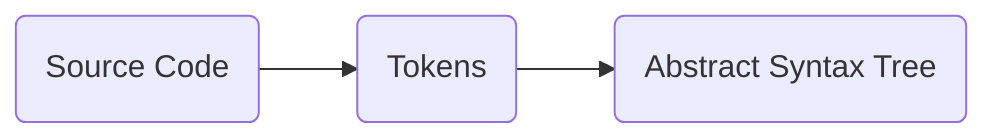

## Chapter 1
*Lexical analysis* consists of transforming a string (the source code) into smaller units called *tokens*. Later on, a parser turns these tokens into an *Abstract Syntax Tree (AST)*.

```mermaid
graph LR

code(Source Code) --> token(Tokens)
token --> ast(Abstract Syntax Tree)
```

