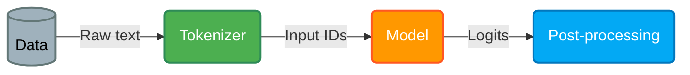

## 1. Transformers models


De façon générale, la bibliothèque #transformers[^1] fournit la fonction #pipeline[^2]. C'est l'API de plus haut niveau fournit par la bibliothèque et est facile à utiliser.
De façon générale ce qui se passe dans la fonction `pipeline` est ce qui suit:



```py
from transformers import pipeline

classfier = pipeline("sentiment-analysis")
predictions = classfier("We are very happy to show you the 🤗 Transformers library.")
```

Et les prédictions retourner sont de la forme:
```py
[
    {'label': 'POSITIVE', 'score': 0.9997795224189758}
]
```

>[!Warning]
>Le label des prédictions peut être soit *POSITIVE*, soit *NEGATIVE*.

La bibliothèque transformers fournit également des tokenizers, on peut en utiliser comme suit:
```py
from transformers import AutoTokenizer

checkpoint = "distilbert-base-uncased-finetuned-sst-2-english"
tokenizer = AutoTokenizer.from_pretrained(checkpoint)

raw_inputs = [
    "I've been waiting for a HuggingFace course my whole life.",
    "I hate this so much!",
]
inputs = tokenizer(raw_inputs, padding=True, truncation=True, return_tensors="pt")
```

Le tokenizer retourne un résultat de type:
```py
{
    'input_ids': tensor([
        [  101,  1045,  1005,  2310,  2042,  3403,  2005,  1037, 17662, 12172, 2607,  2026,  2878,  2166,  1012,   102],
        [  101,  1045,  5223,  2023,  2061,  2172,   999,   102,     0,     0,     0,     0,     0,     0,     0,     0]
    ]), 
    'attention_mask': tensor([
        [1, 1, 1, 1, 1, 1, 1, 1, 1, 1, 1, 1, 1, 1, 1, 1],
        [1, 1, 1, 1, 1, 1, 1, 1, 0, 0, 0, 0, 0, 0, 0, 0]
    ])
}
```

On peut également obtenir un modèle à partir d'un #checkpoint en utilisant `AutoModel.from_pretrained(checkpoint)`. Ainsi, suivant la tâche à réaliser il existe différent classes de types *Auto(something)*. On peut citer par exemple:
- `*Model` (retrieve the hidden states)
- `*ForCausalLM`
- `*ForMaskedLM`
- `*ForMultipleChoice`
- `*ForQuestionAnswering`
- `*ForSequenceClassification`
- `*ForTokenClassification`
- and others 🤗

>[!Warning]
>Les modèles de transformers retournes toujours des #logits donc il nous faut appliquer une dernière transformation afin d'obtenir des probabilités.
>Egalement on peut consulter le mappage de classes du modèle via `model.config.id2label`.


## 2. Using 🤗 transformers
### 2.1 - Créer un transformer
A chaque modèle est associé une classe de configuration à partir de laquelle le modèle est instancié. Instancier un modèle directement avec la configuration fait qu'il soit aléatoirement initialisé et un tel modèle n'est pas bon car il faudra l'entrainer à nouveau, d'où l'intérêt de la méthode `from_pretrained`.

En utilisant la méthode *from_pretrained*, on peut également modifier certains paramètres par défaut de la configuration du modèle pour l'adapter à nos besoins également.

Après avoir entrainer le transformer, on peut le sauvegarder, lui et sa configuration, en utilisant la méthode `save_pretrained`. Cette méthode créer deux fichiers au chemin indiquer:
- **config.json**
- **pytorch_model.bin**

### 2.2 - Tokenizers
#HuggingFace fournit 3 types de tokenizers:
- **Word based**
- **Character based**
- **Sub-word based**

#### Word based tokenizers
Ces tokenizers se basent sur les espaces, les ponctuations ou d'autres règles pour diviser la séquences en différents mots.
Cependant, il y a certaines limites; par exemple *dog* et *dogs* bien qu'étant similaires seront considérés comme des tokens différents. 
Egalement on peut se retrouver avec un énorme #vocabulaire ce qui conduit à la création d'un lourd modèle. Pour pallier à cela, on peut indiquer au tokenizer des mots à *ignorer*, ou bien lui dire de prendre les *n mots les plus fréquents*. 

#### Character based tokenizers
Les vocabulaires créés avec ce genre de tokenizers sont de tailles raisonnables car dans les langues, le nombre de lettres est relativement petit contrairement au nombre de mots d'une langue.
Cependant, ce genre de tokenizer fait qu'on perde le sens d'une phrase car les lettres ne fournissent pas d'information sur le contexte de la phrase.
Egalement avec ce genre de tokenizers, on se retrouve avec de trop grandes séquences que notre modèle doit traiter, ce qui n'est pas idéale contrairement aux séquences de mots.

#### Sub-word based tokenizers
Pour bénéficier des atouts des précédents types de tokenizers, on a recours au sub-word based tokenizers.


## 3. Tokenizers library

Il est possible d'entrainer un tokenizer à partir d'un existant lorsqu'on veut entrainer un modèle sur un langage différent du langage initial. Du genre entrainer *bert-base-uncased* sur un texte *chinois*. Pour ce faire, il suffit d'utiliser la méthode:

```py
AutoTokenizer.train_new_from_iterator(**kwargs)
```


[^1]: [🤗 Transformers (huggingface.co)](https://huggingface.co/docs/transformers/index)

[^2]: [Quick tour (huggingface.co)](https://huggingface.co/docs/transformers/v4.34.0/en/main_classes/pipelines#transformers.pipeline)