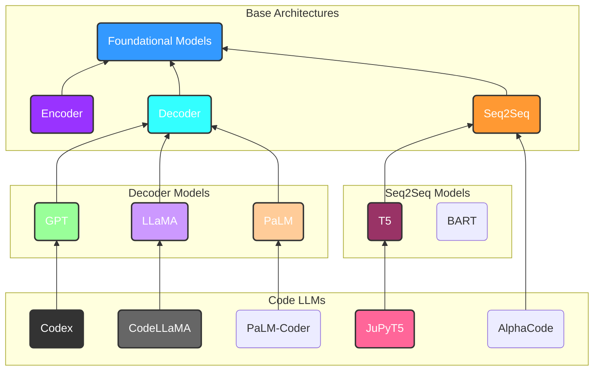
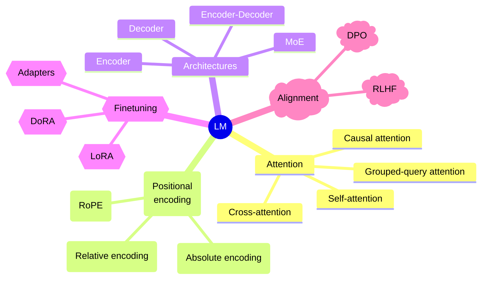

## A taxonomy of LLMs

This survey aims to evaluate LLMs fine-tuned for programming related tasks. Moreover, foundational models generalization abilities are evaluated in this domain. Based on the #transformer architecture introduced in the paper **Attention is all you need** by A. Vaswani et Al[^1], this zoo of models proposes novel improvements to the former architecture from **Scaling Language Modeling with Pathways**[^2] to **Mixture of Experts**[^3]. Authors of these code LLMs can be classified into four different categories:
1. Company-led
2. University-led
3. Research teams and open source communities
4. Individuals and anonymous

Microsoft is the leading in code #LLM authoring with 8 models. Do not that some company-led LLMs are released as open-source software.

The chart below depicts the relationship between some of these models. Do not that even though most of Code LLMs are trained by fine-tuning a foundational model, some models like **AlphaCode**[^4] are trained from the ground up with a *code assistance objective*. 

## Code LLMs vs general LLMs
Many studies proved that the bigger, the better its performance is. Models like GPT-4 and ChatGPT tend to produce more robust code than other general LLMs. Moreover, when a Code LLM size is comparable to a general's one, the Code LLM tends to outperform it. 
Also, it's important to note that models using SOTA technics such as **RLHF**[^5] tend to align more with human preferences. Models based on an *encoder-decoder* architecture like AlphaCode are not well aligned with human preference due the nature of their architecture. For instance, AlphaCode is specifically designed to solve competitive programming problems. AlphaCode aligns well with competitive programming settings where clear inputs and outputs are defined. Human preference is measured using the **HumanEval**[^6] benchmark.

>[!note]
>Dive more into these evaluation benchmarks and why #seq2seq models perform poorly for HumanEval.

It's difficult to say to say that Code LLMs are better than the general ones due to the fact they tend to perform poorly in the some tasks where general LLMs outperforms them. As a matter of fact, deciding which one is better than the other depends on the task on which the model is evaluated.

## Finding tasks where a category of LLM is good at

### Code generation
Code LLMs are mainly used for code generation tasks. In order to assess their capabilities many benchmarks are proposed but an interesting one is #HumanEval.

>[!summary] The HumanEval benchmark
> The HumanEval[^7] consists of **164 hand-crafted** programming challenges in Python where the model is prompted to complete a function based on the docstrings. After that the generated method has to pass some unit tests to be validated. One can also measure the quality of the generated code by comparing it to human code using a metric such as **CodeBLEU**[^8] a variant of **BLEU**[^9].

Code generation in HumanEval is evaluated by *passes*. For instance a high *pass@1* indicates that the model can generate the correct code on the first attempt. Thus the concept can be generalized to $pass@k$.

#### Encoder-decoder based models and HumanEval
The reason why #seq2seq models perform poorly on HumanEval is due to the fact that they are more aligned with competitive programming settings. The original transformer architecture[^1] purpose was #machine-translation. This implies that there was an input and output on which the model needed to align. The same analogy can be done with competitive programming where inputs and outputs are clearly defined and the model tries to align to this settings. Do note that HumanEval requires performing #reasoning, problem-solving, and handle code-specific aspects, which go beyond simple input-output alignment.

Meanwhile, #decoder based models are more of *stochastic parrots*, they aim to predict the next most likely token based on the previous ones. Thus, they focus more on the prompt-based prediction. They can be expressed as:

$$
\text{token$_{n+1}$} = p(x_{n+1} \vert x_1, x_2, \dots, x_n)
$$

>[!warning]
>There is no best model #architecture. Each of them aims to handle a specific task.

 
### Other tasks
These Code LLMs can also be used for tasks like **test cases generation** where the GPT family is leading the space, **code summarization** where *CodeT5* seems to perform the best among a **few** selected LLMs. There's also **code summarization** where *ChatGPT* is the best. It summarize each code snippet in **one** sentence. **Vulnerabiliy repair and code translation** are also some tasks where they are evaluated.

## New horizons
Even though the #transformer architecture excels in each modality it still has its *quadratic* complexity due to the #attention mechanism on which it relies. Other approaches could be explored with *state-space models(SSM)* like **Mamba**[^10] which scales in *linear* time and space complexity while preserving the model's accuracy in contrast to other #SSM based models.

We could also leverage optimized versions of the attention mechanism like #flash-attention[^11] which relies on the GPU architecture to accelerate computation by introducing sparsity, reduce I/O ops.

Moreover, fine-tuning general LLMs for code can be done by using *parameter efficient fine-tuning (PEFT)* technics like **LoRA**[^12] to compress the model while preserving accuracy. LoRA operates as follows:
- Given our original weights matrix $W_0 \in \mathbb{R}^{d \times k}$, it can be represented as the sum of two matrices $W_0 + \Delta W = W_0 + BA$.
- The $\Delta W$ matrix can be decomposed into two matrices $B \in \mathbb{R}^{d \times r}$ and $A \in \mathbb{R}^{r \times k}$, where the rank $r \ll min(d,k)$.
- During training $W_0$ is frozen. Both $W_0$ and $\Delta W$ are multiplied with the same input $x$ and the product $\Delta Wx$ is scaled by a factor $\frac{\alpha}{r}$, where $\alpha$ is a multiple of $r$. 
- The output of the model is the sum of the two outputs:

  

$$

h = W_0x + \Delta Wx = W_0x + BAx

$$

## Key innovations in the NLP space for Language Modeling

>[!important] Experiment design
>- Evaluate LLMs multilingual capabilities
>- Benchmark them on competitive programming tasks
>- Try to find multimodal models and asses their capabilities
>- Test these models on recent technologies
>- Give them complex tasks
>- Test their NLU performance by asking them code explanation

[^1]: [Attention is all you need](https://arxiv.org/abs/1706.03762)
[^2]: [Scaling Language Modeling with Pathways](https://doi.org/10.48550/arXiv.2204.02311)
[^3]: [Efficient Large Scale Language Modeling with Mixtures of Experts](https://aclanthology.org/2022.emnlp-main.804)
[^4]: [Competition-level code generation with AlphaCode](https://arxiv.org/abs/https://www.science.org/doi/pdf/10.1126/science.abq1158)
[^5]: [[2305.18438] Reinforcement Learning with Human Feedback: Learning Dynamic Choices via Pessimism (arxiv.org)](https://arxiv.org/abs/2305.18438)
[^6]: Evaluating large language models trained on code. arXiv preprint arXiv:2107.03374 (2021).
[^7]: [[2107.03374] Evaluating Large Language Models Trained on Code (arxiv.org)](https://arxiv.org/abs/2107.03374)
[^8]: [[2009.10297] CodeBLEU: a Method for Automatic Evaluation of Code Synthesis (arxiv.org)](https://arxiv.org/abs/2009.10297)
[^9]: [Bleu: a Method for Automatic Evaluation of Machine Translation](https://aclanthology.org/P02-1040) (Papineni et al., ACL 2002)]
[^10]: [[2312.00752] Mamba: Linear-Time Sequence Modeling with Selective State Spaces (arxiv.org)](https://arxiv.org/abs/2312.00752)
[^11]: [[2205.14135] FlashAttention: Fast and Memory-Efficient Exact Attention with IO-Awareness (arxiv.org)](https://arxiv.org/abs/2205.14135)
[^12]: [[2402.12354] LoRA+: Efficient Low Rank Adaptation of Large Models (arxiv.org)](https://arxiv.org/abs/2402.12354)